# Stage 1 Results

Auto-generated by `scripts/generate_report.py` from `outputs/`. Re-run that script after new experiments to refresh this file.

## Accuracy table

| Dataset | Encoder | Method | T | K-shot | Runs | Test Accuracy | Delta vs baseline |
|---|---|---|---|---|---|---|---|
| dtd | dinov2_vits14 | linear_probe | - | 5 | 3 | 63.01% +/- 0.27% | - |
| dtd | dinov2_vits14 | linear_probe | - | 10 | 3 | 68.58% +/- 0.80% | - |
| dtd | dinov2_vits14 | linear_probe | - | full | 3 | 76.35% +/- 0.72% | - |
| dtd | dinov2_vits14 | prototype | - | 5 | 3 | 64.33% +/- 0.30% | - |
| dtd | dinov2_vits14 | prototype | - | 10 | 3 | 68.46% +/- 1.01% | - |
| dtd | dinov2_vits14 | prototype | - | full | 1 | 72.29% | - |
| dtd | dinov2_vits14 | fm_standard | 4 | 5 | 3 | 61.31% +/- 0.75% | -3.01% +/- 0.46% |
| dtd | dinov2_vits14 | fm_standard | 12 | 5 | 3 | 61.70% +/- 0.83% | -2.62% +/- 0.55% |
| dtd | dinov2_vits14 | fm_standard | 4 | 10 | 3 | 65.60% +/- 0.59% | -2.85% +/- 1.45% |
| dtd | dinov2_vits14 | fm_standard | 12 | 10 | 3 | 65.92% +/- 0.57% | -2.54% +/- 1.48% |
| dtd | dinov2_vits14 | fm_standard | 4 | full | 1 | 74.63% | +2.34% |
| dtd | dinov2_vits14 | fm_standard | 12 | full | 1 | 74.79% | +2.50% |
| dtd | dinov2_vits14 | fm_rolled | 4 | 5 | 3 | 57.48% +/- 1.32% | -6.84% +/- 1.02% |
| dtd | dinov2_vits14 | fm_rolled | 12 | 5 | 3 | 57.50% +/- 1.04% | -6.83% +/- 0.73% |
| dtd | dinov2_vits14 | fm_rolled | 4 | 10 | 3 | 61.74% +/- 0.48% | -6.72% +/- 1.46% |
| dtd | dinov2_vits14 | fm_rolled | 12 | 10 | 3 | 61.74% +/- 0.27% | -6.72% +/- 1.28% |
| dtd | dinov2_vits14 | fm_rolled | 4 | full | 1 | 73.51% | +1.22% |
| dtd | dinov2_vits14 | fm_rolled | 12 | full | 1 | 72.93% | +0.64% |
| dtd | resnet18 | linear_probe | - | 5 | 3 | 45.80% +/- 0.75% | - |
| dtd | resnet18 | linear_probe | - | 10 | 3 | 52.39% +/- 0.74% | - |
| dtd | resnet18 | linear_probe | - | full | 3 | 62.55% +/- 0.51% | - |
| dtd | resnet18 | prototype | - | 5 | 3 | 46.93% +/- 0.32% | - |
| dtd | resnet18 | prototype | - | 10 | 3 | 51.97% +/- 0.54% | - |
| dtd | resnet18 | prototype | - | full | 1 | 58.78% | - |
| dtd | resnet18 | fm_standard | 4 | 5 | 3 | 44.82% +/- 1.45% | -2.11% +/- 1.19% |
| dtd | resnet18 | fm_standard | 12 | 5 | 3 | 45.14% +/- 1.36% | -1.79% +/- 1.07% |
| dtd | resnet18 | fm_standard | 4 | 10 | 3 | 48.65% +/- 1.02% | -3.32% +/- 0.52% |
| dtd | resnet18 | fm_standard | 12 | 10 | 3 | 49.13% +/- 1.17% | -2.84% +/- 0.65% |
| dtd | resnet18 | fm_standard | 4 | full | 1 | 59.52% | +0.74% |
| dtd | resnet18 | fm_standard | 12 | full | 1 | 59.57% | +0.80% |
| dtd | resnet18 | fm_rolled | 4 | 5 | 3 | 40.51% +/- 0.75% | -6.42% +/- 0.45% |
| dtd | resnet18 | fm_rolled | 12 | 5 | 3 | 40.60% +/- 0.85% | -6.33% +/- 0.53% |
| dtd | resnet18 | fm_rolled | 4 | 10 | 3 | 40.62% +/- 1.00% | -11.35% +/- 1.20% |
| dtd | resnet18 | fm_rolled | 12 | 10 | 3 | 41.65% +/- 0.90% | -10.32% +/- 0.88% |
| dtd | resnet18 | fm_rolled | 4 | full | 1 | 56.06% | -2.71% |
| dtd | resnet18 | fm_rolled | 12 | full | 1 | 56.01% | -2.77% |
| flowers102 | resnet18 | linear_probe | - | 5 | 3 | 75.13% +/- 0.22% | - |
| flowers102 | resnet18 | linear_probe | - | 10 | 3 | 83.22% +/- 0.14% | - |
| flowers102 | resnet18 | linear_probe | - | full | 3 | 83.22% +/- 0.14% | - |
| flowers102 | resnet18 | prototype | - | 5 | 3 | 69.62% +/- 0.32% | - |
| flowers102 | resnet18 | prototype | - | 10 | 3 | 75.22% +/- 0.00% | - |
| flowers102 | resnet18 | prototype | - | full | 1 | 75.22% | - |
| flowers102 | resnet18 | fm_standard | 4 | 5 | 3 | 69.19% +/- 1.02% | -0.43% +/- 0.85% |
| flowers102 | resnet18 | fm_standard | 12 | 5 | 3 | 69.59% +/- 1.01% | -0.02% +/- 0.82% |
| flowers102 | resnet18 | fm_standard | 4 | 10 | 3 | 76.83% +/- 0.11% | +1.62% +/- 0.11% |
| flowers102 | resnet18 | fm_standard | 12 | 10 | 3 | 77.17% +/- 0.21% | +1.95% +/- 0.21% |
| flowers102 | resnet18 | fm_standard | 4 | full | 1 | 76.79% | +1.58% |
| flowers102 | resnet18 | fm_standard | 12 | full | 1 | 76.94% | +1.72% |
| flowers102 | resnet18 | fm_rolled | 4 | 5 | 3 | 62.54% +/- 1.32% | -7.07% +/- 1.12% |
| flowers102 | resnet18 | fm_rolled | 12 | 5 | 3 | 63.07% +/- 0.68% | -6.54% +/- 0.40% |
| flowers102 | resnet18 | fm_rolled | 4 | 10 | 3 | 72.46% +/- 0.38% | -2.76% +/- 0.38% |
| flowers102 | resnet18 | fm_rolled | 12 | 10 | 3 | 72.65% +/- 0.37% | -2.57% +/- 0.37% |
| flowers102 | resnet18 | fm_rolled | 4 | full | 1 | 72.89% | -2.33% |
| flowers102 | resnet18 | fm_rolled | 12 | full | 1 | 73.07% | -2.15% |

## Accuracy vs. training-set size

### dtd / dinov2_vits14

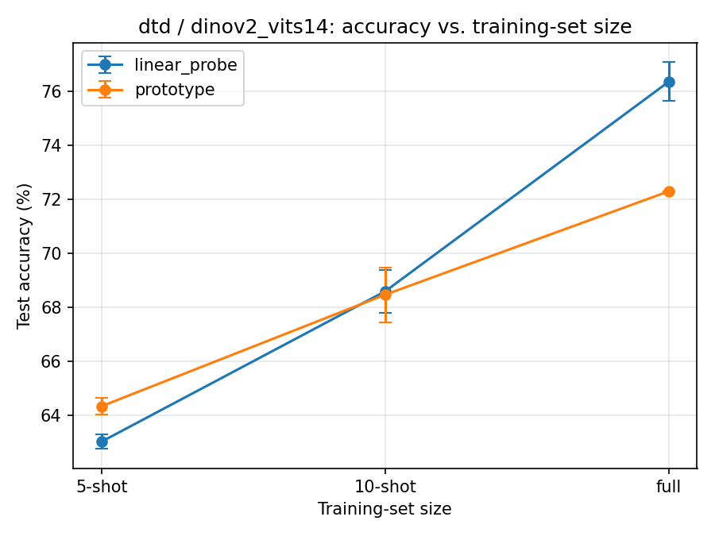

### dtd / resnet18

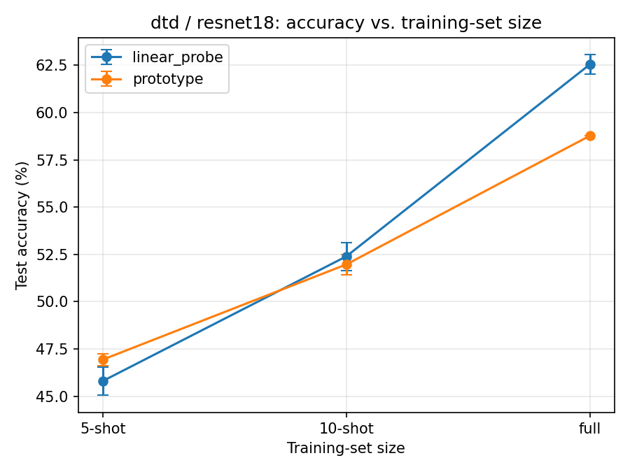

### flowers102 / resnet18

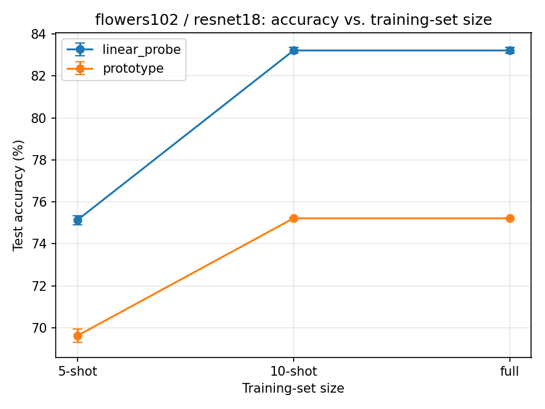

## Training / validation loss (10-shot, seed 0)

### dtd / dinov2_vits14

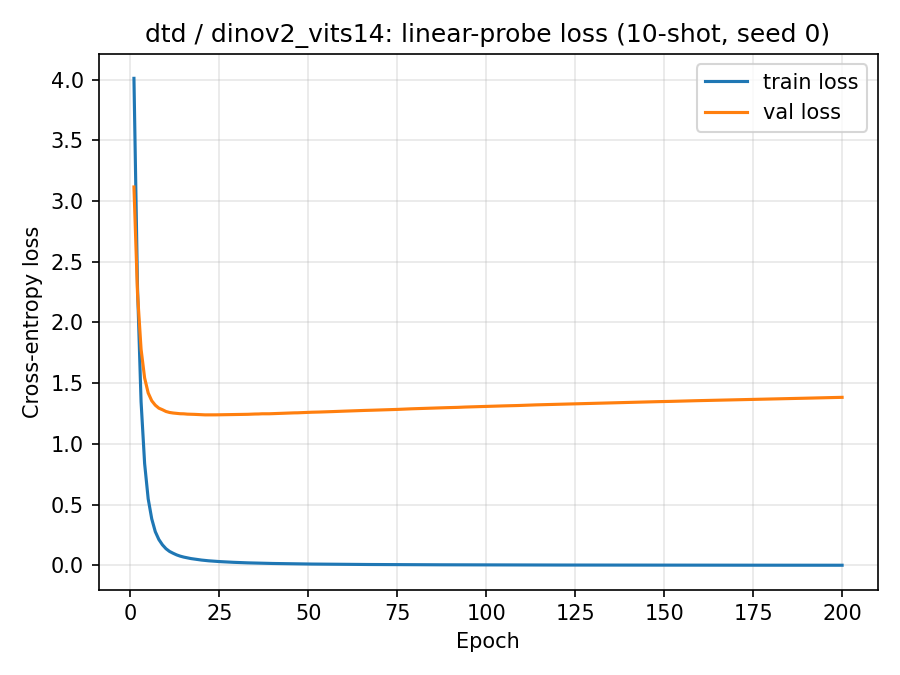

### dtd / resnet18

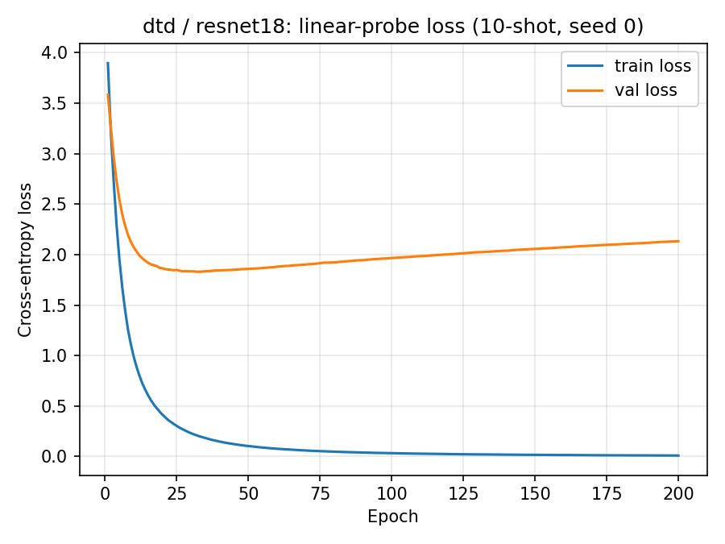

### flowers102 / resnet18

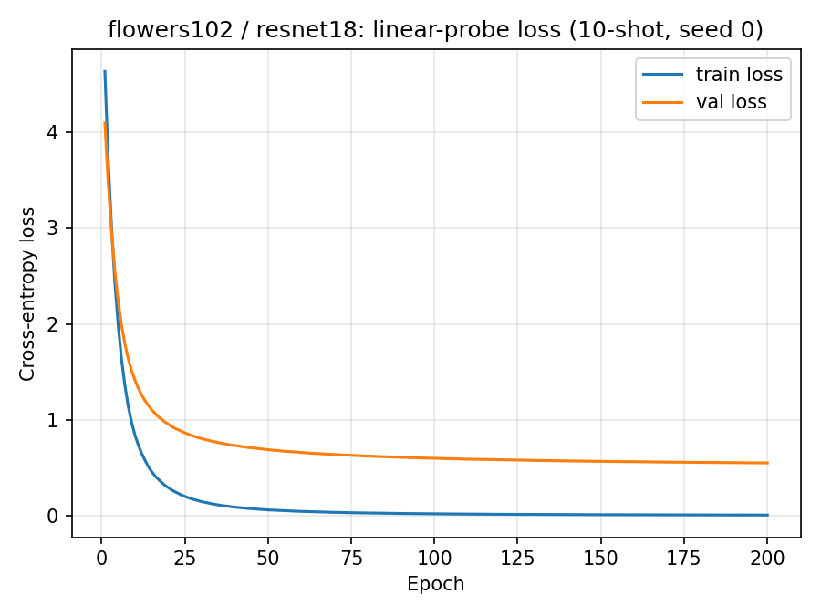

## Confusion matrices (row-normalized)

### dtd / dinov2_vits14

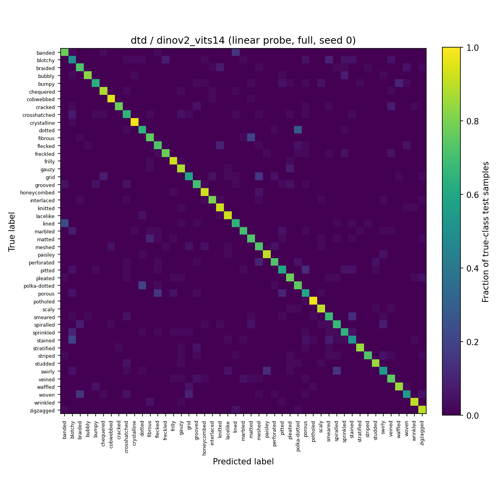

### flowers102 / resnet18

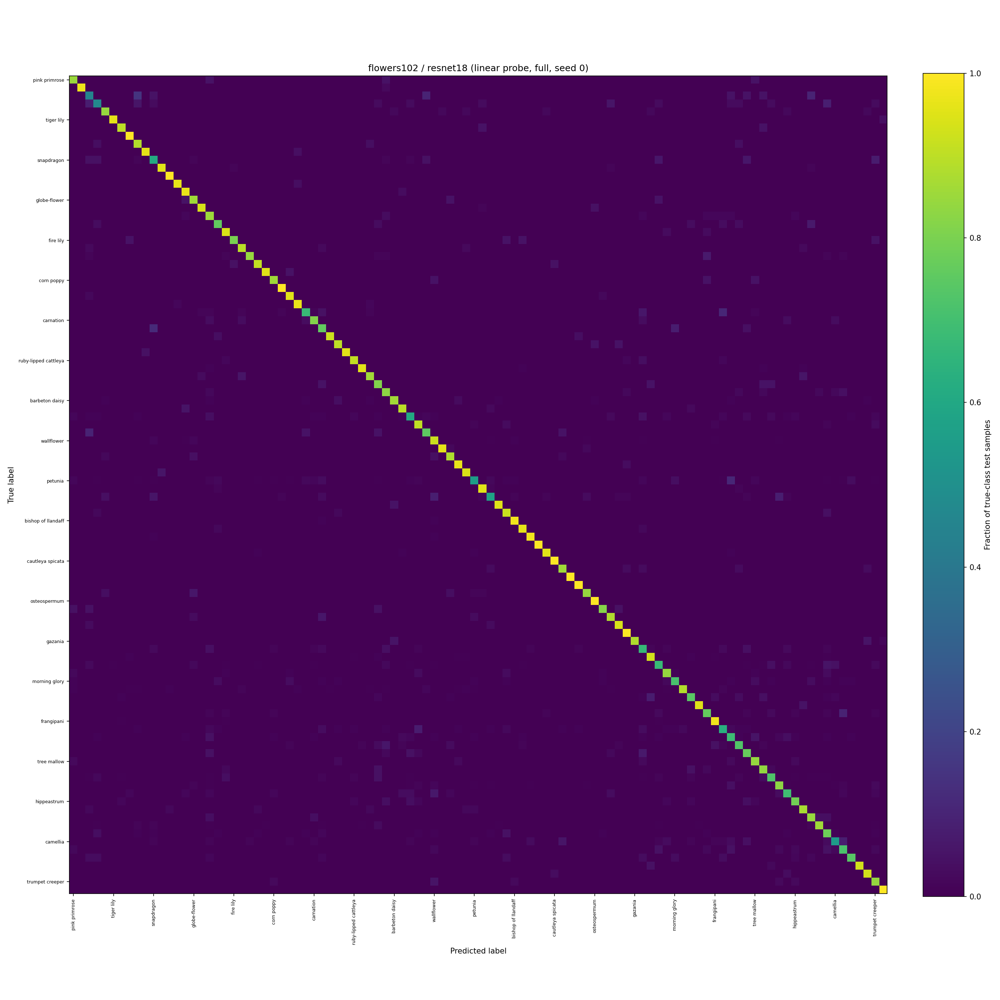

## Feature-space visualizations (t-SNE; qualitative, not a performance metric)

### dtd / dinov2_vits14

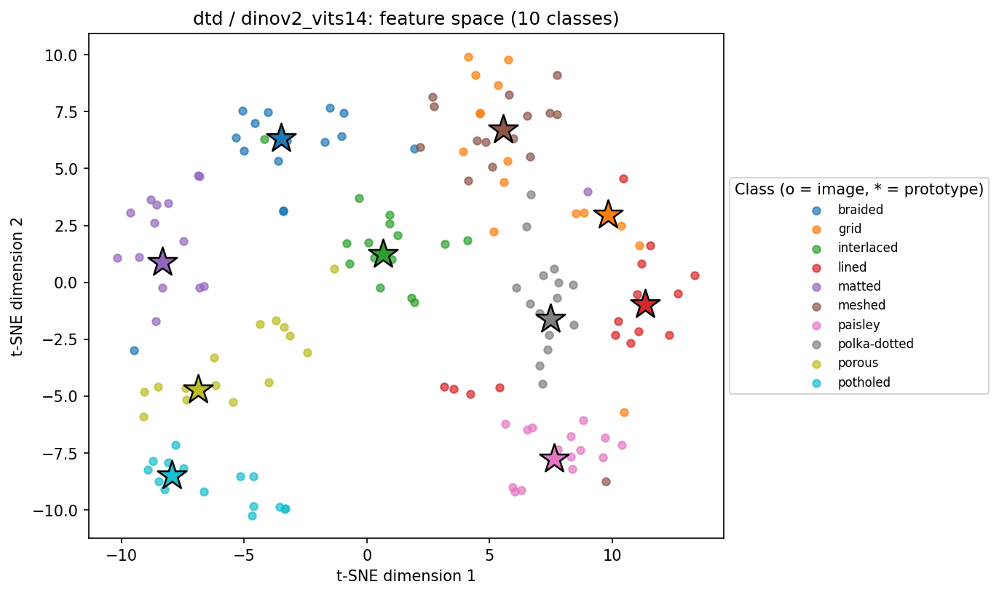

### dtd / resnet18

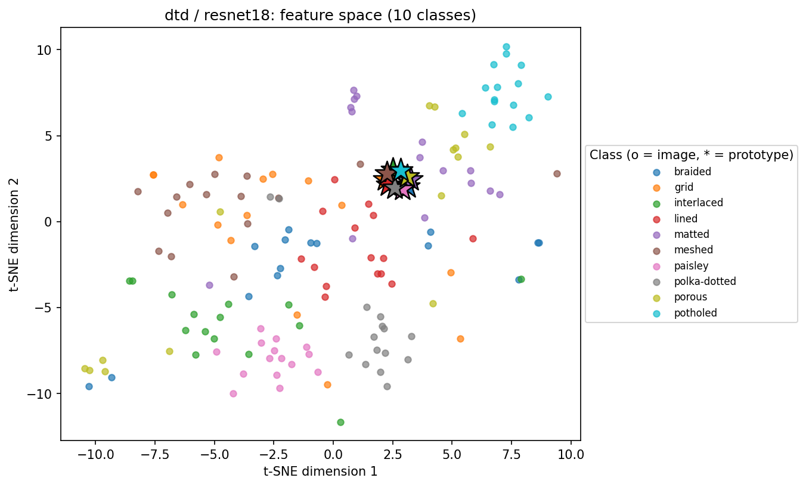

### flowers102 / resnet18

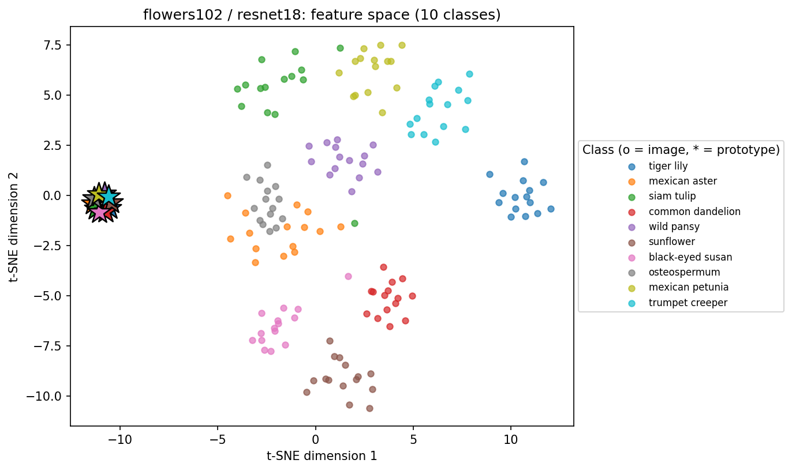

---

# Stage 2 Results: Flow Matching to Class Prototypes

Each flow-matching run reuses the *same* K-shot subset, seed and class prototypes as the corresponding Stage 1 prototype run, so every `Delta` below is a paired comparison against that run's own baseline.

## Comparison tables

### dtd / dinov2_vits14

| K-shot | prototype | fm_standard (T=4) | fm_standard (T=12) | fm_rolled (T=4) | fm_rolled (T=12) |
|---|---|---|---|---|---|
| 5 | 64.33% +/- 0.30% | 61.31% +/- 0.75% (-3.01) | 61.70% +/- 0.83% (-2.62) | 57.48% +/- 1.32% (-6.84) | 57.50% +/- 1.04% (-6.83) |
| 10 | 68.46% +/- 1.01% | 65.60% +/- 0.59% (-2.85) | 65.92% +/- 0.57% (-2.54) | 61.74% +/- 0.48% (-6.72) | 61.74% +/- 0.27% (-6.72) |
| full | 72.29% | 74.63% (+2.34) | 74.79% (+2.50) | 73.51% (+1.22) | 72.93% (+0.64) |

### dtd / resnet18

| K-shot | prototype | fm_standard (T=4) | fm_standard (T=12) | fm_rolled (T=4) | fm_rolled (T=12) |
|---|---|---|---|---|---|
| 5 | 46.93% +/- 0.32% | 44.82% +/- 1.45% (-2.11) | 45.14% +/- 1.36% (-1.79) | 40.51% +/- 0.75% (-6.42) | 40.60% +/- 0.85% (-6.33) |
| 10 | 51.97% +/- 0.54% | 48.65% +/- 1.02% (-3.32) | 49.13% +/- 1.17% (-2.84) | 40.62% +/- 1.00% (-11.35) | 41.65% +/- 0.90% (-10.32) |
| full | 58.78% | 59.52% (+0.74) | 59.57% (+0.80) | 56.06% (-2.71) | 56.01% (-2.77) |

### flowers102 / resnet18

| K-shot | prototype | fm_standard (T=4) | fm_standard (T=12) | fm_rolled (T=4) | fm_rolled (T=12) |
|---|---|---|---|---|---|
| 5 | 69.62% +/- 0.32% | 69.19% +/- 1.02% (-0.43) | 69.59% +/- 1.01% (-0.02) | 62.54% +/- 1.32% (-7.07) | 63.07% +/- 0.68% (-6.54) |
| 10 | 75.22% +/- 0.00% | 76.83% +/- 0.11% (+1.62) | 77.17% +/- 0.21% (+1.95) | 72.46% +/- 0.38% (-2.76) | 72.65% +/- 0.37% (-2.57) |
| full | 75.22% | 76.79% (+1.58) | 76.94% (+1.72) | 72.89% (-2.33) | 73.07% (-2.15) |

## Observations

**Standard FM outperforms rolled-out training in 18 of 18 matched comparisons** (same dataset, encoder, K and T). The ranking is consistent rather than marginal.

**The flow-matching layer helps only when there is enough data.** Standard FM improves on the prototype baseline in 8 of 18 settings overall, but in 6 of the 6 full-data settings; rolled-out improves in 2 of 18. The change relative to the baseline grows with training-set size on both DTD encoders (see the delta-vs-K plots).

**Rolled-out training overfits its own objective.** Its final training loss is roughly an order of magnitude below standard FM's, yet its validation loss *rises* after roughly 25 epochs and keeps rising for the rest of the 200-epoch budget (see the training curves). Supervising only the endpoint lets the network memorize the transport of its training points.

**Rolled-out training learns a jump, not a transport.** Because nothing constrains the intermediate states, its first Euler step is several times larger than its last, so the flow effectively completes immediately. The trajectory plots show this directly, and it explains why T makes so little difference to the results.

**Contraction is not discrimination.** Rolled-out FM pulls test features *closer* to their own prototypes than standard FM does and still classifies them worse: pulling every point inward also drags points that sit nearer a wrong prototype, locking in errors instead of correcting them. The per-step figures separate these two quantities for exactly this reason - similarity to the own prototype rises while the margin against the best competing prototype falls.

**The flow over-transports.** In every setting measured, accuracy along the flow peaks *before* t=1 and then declines, and the mean margin ends negative. Integrating to completion overshoots the point of best class separation. This is the clearest direction for further work, but note that picking a stopping time from these curves would be test-set selection; doing it properly would require the validation split.

**Reverse flow separates the two variants sharply.** Integrating backwards from a prototype, standard FM produces a point that genuinely resembles real members of that class, while rolled-out FM diverges by orders of magnitude and produces a point carrying no class information. A one-step jump is not an invertible field.

### Caveats

- **The full-data settings are single runs.** Following the Stage 1 prototype protocol ("the full-data result requires one run"), K=full has no repetitions and therefore no error bars, while the few-shot settings vary by up to roughly 1.5 percentage points across seeds. The positive full-data deltas should be read with that in mind.

- **For Flowers-102, K=10 and K=full are the same data.** The official training split holds exactly 10 images per class, so the 10-shot subsets are the full split. The prototype baseline is identical in both rows with zero variance, and the small differences between the FM rows come only from the velocity network's initialization seed.

- **Two-dimensional projections are qualitative.** The trajectory PCA captures well under half the variance in some settings (printed on each axis), so apparent distances understate the true geometry. Every quantitative claim above is computed in the full feature space.

## Stage 2: accuracy vs. training-set size

### dtd / dinov2_vits14

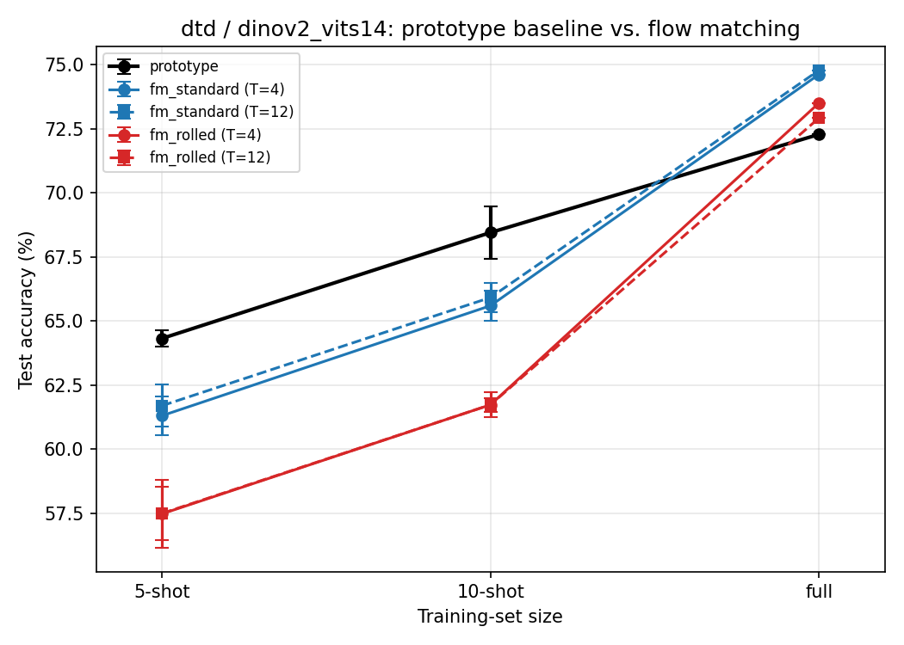

### dtd / resnet18

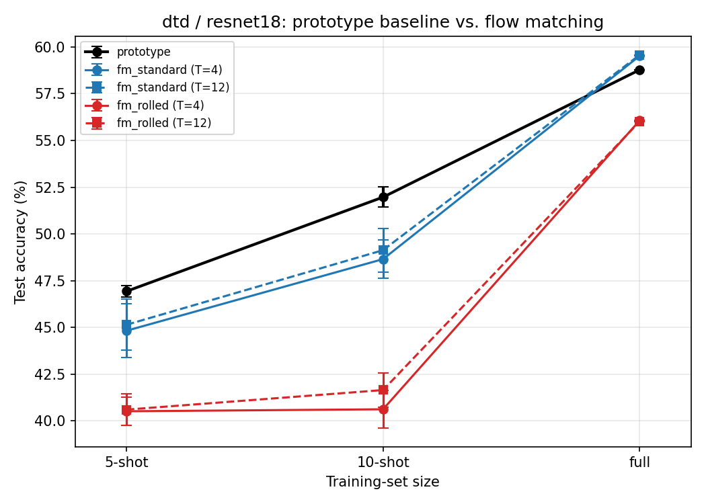

### flowers102 / resnet18

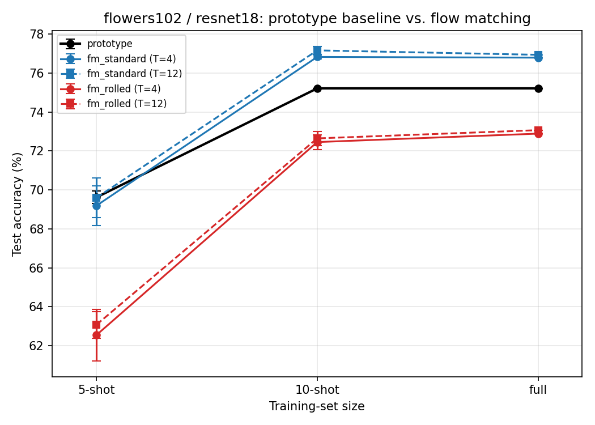

## Stage 2: change in accuracy relative to the prototype baseline

### dtd / dinov2_vits14

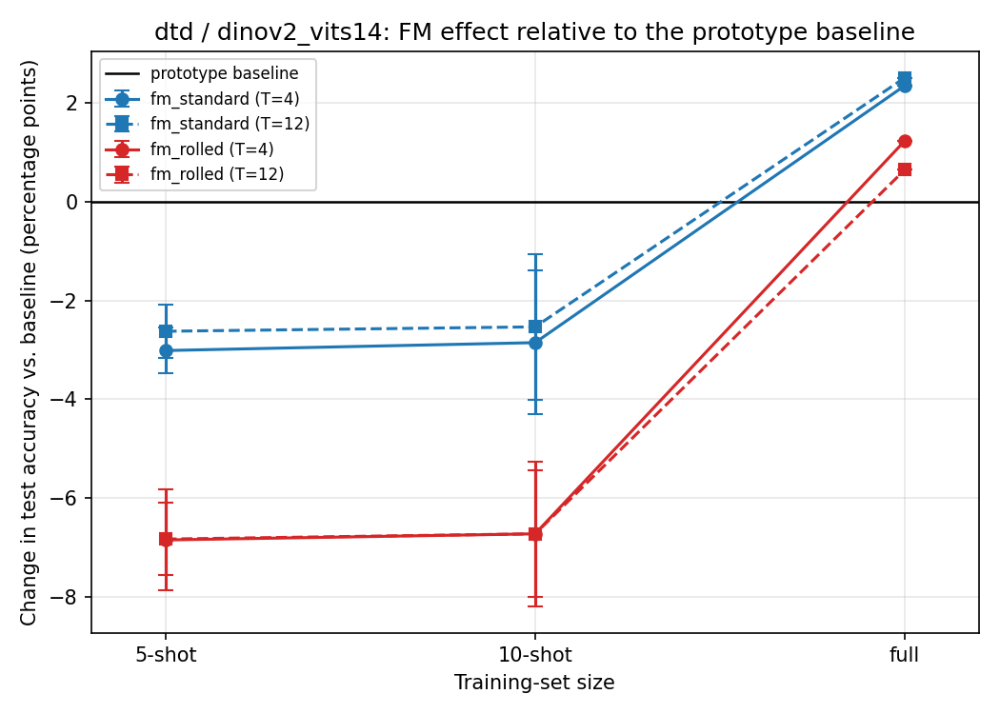

### dtd / resnet18

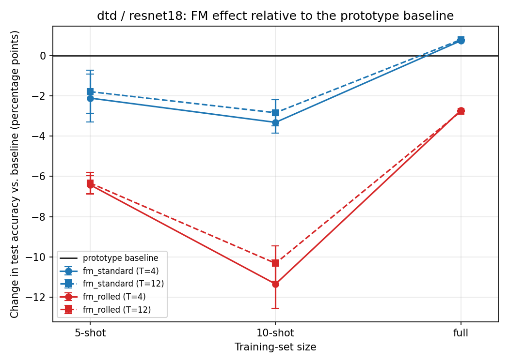

### flowers102 / resnet18

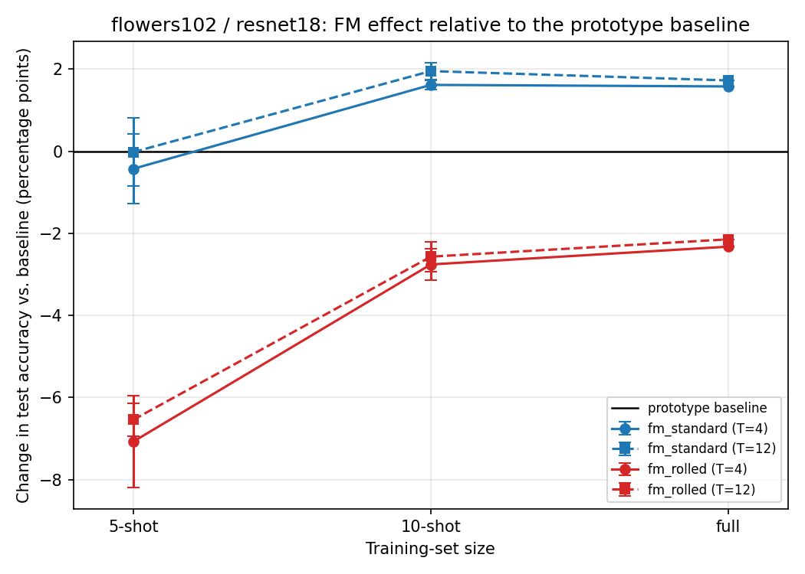

## Stage 2: flow-matching training curves (10-shot, seed 0)

### dtd / dinov2_vits14

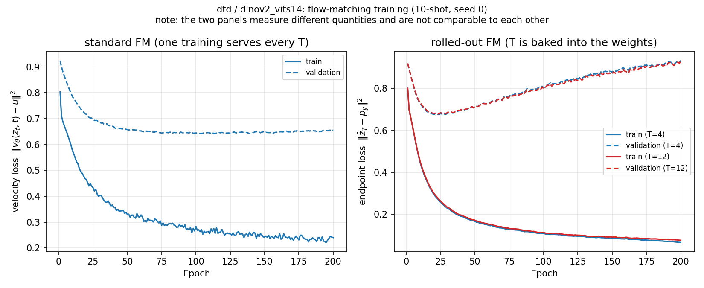

### dtd / resnet18

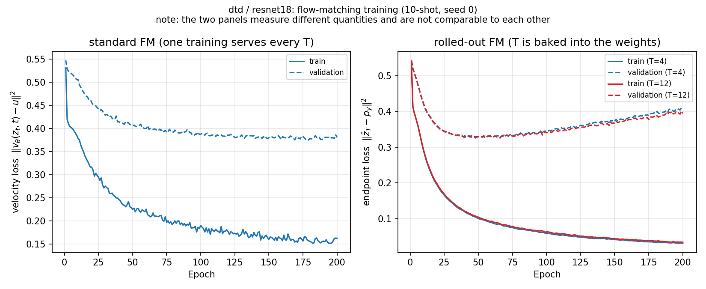

### flowers102 / resnet18

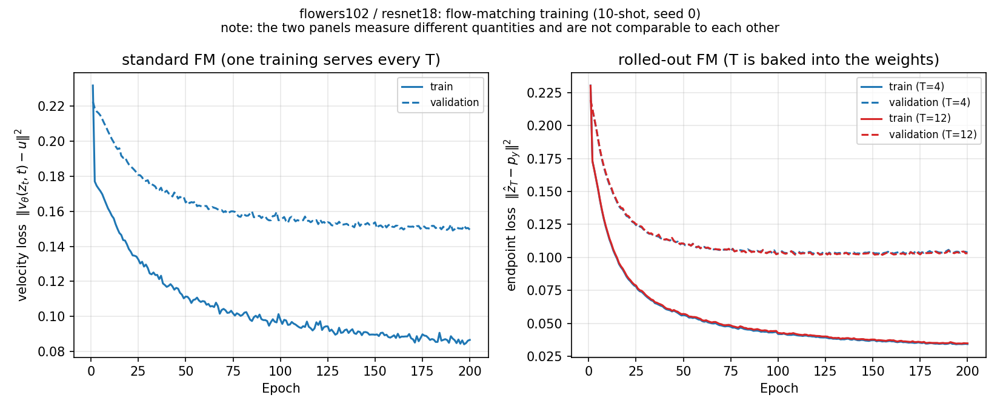

## Stage 2: feature space before and after flow matching (t-SNE)

### dtd / dinov2_vits14

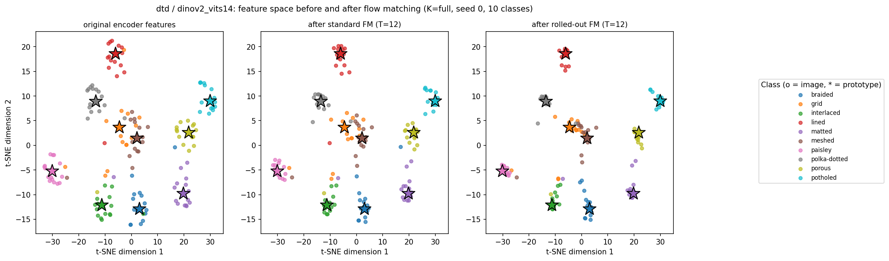

### dtd / resnet18

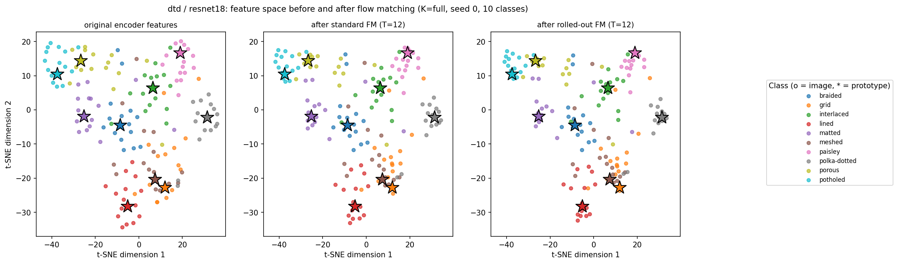

### flowers102 / resnet18

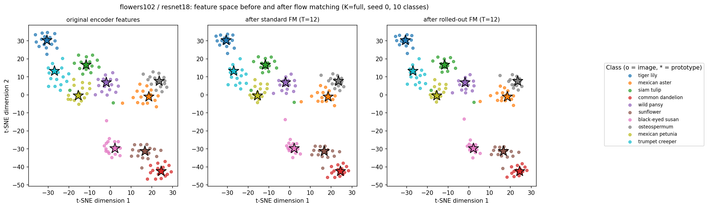

## Stage 2: flow trajectories (PCA)

### dtd / dinov2_vits14

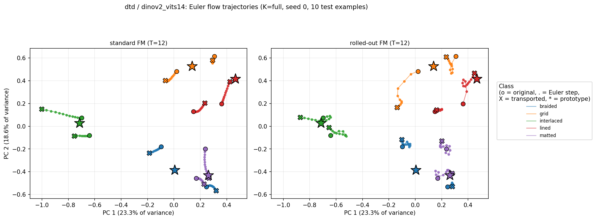

### dtd / resnet18

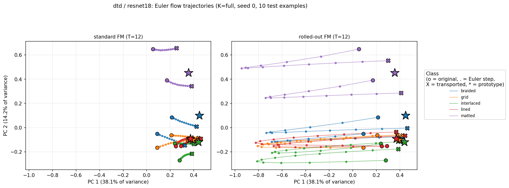

### flowers102 / resnet18

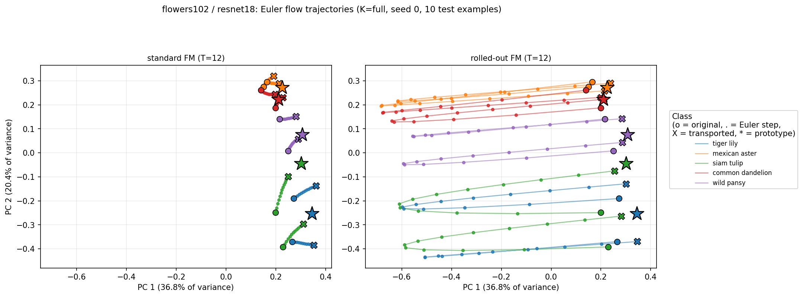

## Stage 2: reverse flow from the class prototypes (PCA)

### dtd / dinov2_vits14

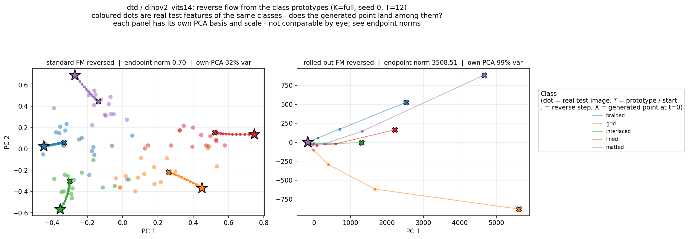

### dtd / resnet18

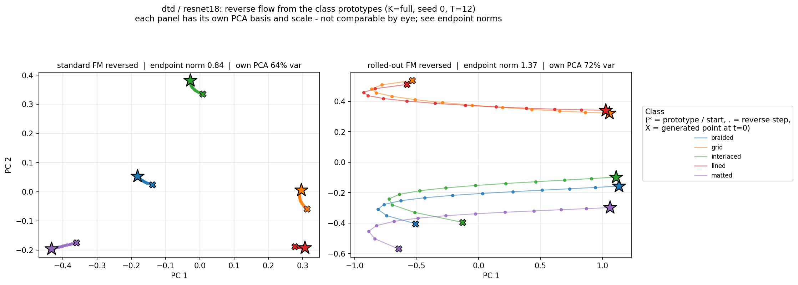

### flowers102 / resnet18

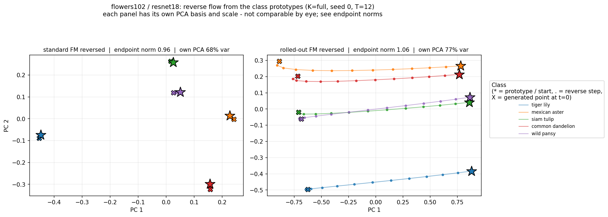

## Stage 2: metrics along the flow

### dtd (K=10) / dinov2_vits14

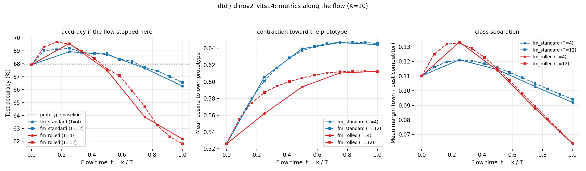

### dtd (K=full) / dinov2_vits14

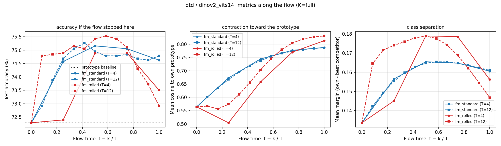

### dtd (K=10) / resnet18

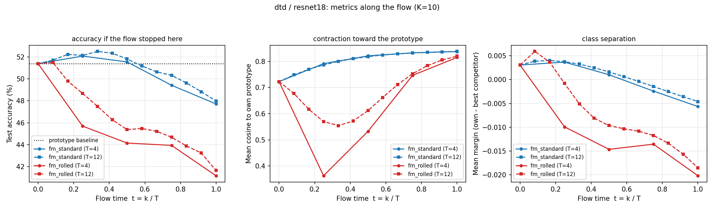

### dtd (K=full) / resnet18

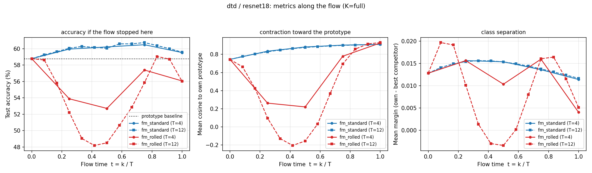

### flowers102 (K=10) / resnet18

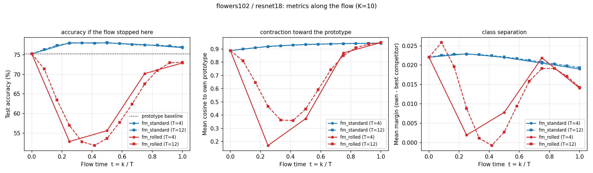

### flowers102 (K=full) / resnet18

