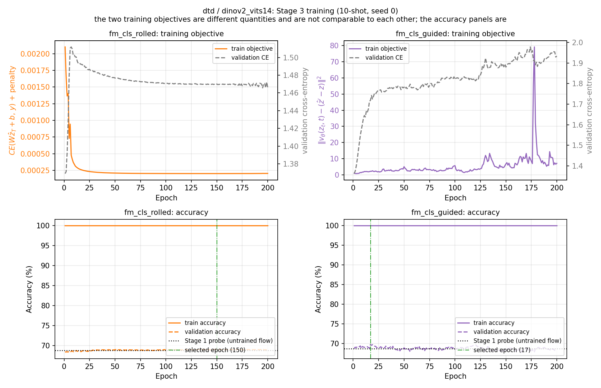
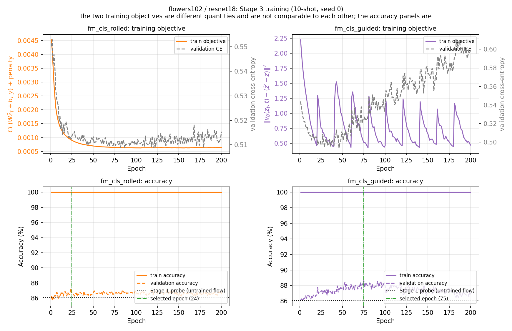
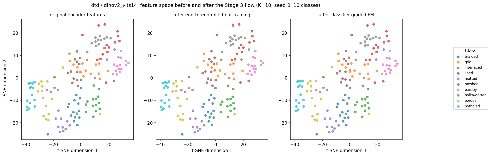
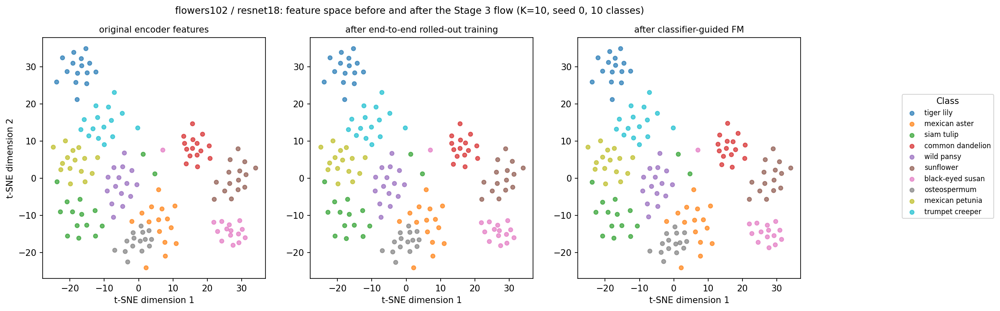

# Stage 1 Results

Auto-generated by `scripts/generate_report.py` from `outputs/`. Re-run that script after new experiments to refresh this file.

## Accuracy table

| Dataset | Encoder | Stage | Method | T | K-shot | Runs | Test Accuracy | Delta vs baseline | Baseline |
|---|---|---|---|---|---|---|---|---|---|
| dtd | dinov2_vits14 | 1 | linear_probe | - | 5 | 3 | 63.01% +/- 0.27% | - | - |
| dtd | dinov2_vits14 | 1 | linear_probe | - | 10 | 3 | 68.58% +/- 0.80% | - | - |
| dtd | dinov2_vits14 | 1 | linear_probe | - | full | 3 | 76.35% +/- 0.72% | - | - |
| dtd | dinov2_vits14 | 3 | fm_cls_rolled | 4 | 10 | 3 | 68.78% +/- 0.61% | +0.20% +/- 0.19% | linear_probe |
| dtd | dinov2_vits14 | 3 | fm_cls_guided | 4 | 10 | 3 | 69.63% +/- 0.37% | +1.05% +/- 0.87% | linear_probe |
| dtd | dinov2_vits14 | 1 | prototype | - | 5 | 3 | 64.33% +/- 0.30% | - | - |
| dtd | dinov2_vits14 | 1 | prototype | - | 10 | 3 | 68.46% +/- 1.01% | - | - |
| dtd | dinov2_vits14 | 1 | prototype | - | full | 1 | 72.29% | - | - |
| dtd | dinov2_vits14 | 2 | fm_standard | 4 | 5 | 3 | 61.31% +/- 0.75% | -3.01% +/- 0.46% | prototype |
| dtd | dinov2_vits14 | 2 | fm_standard | 12 | 5 | 3 | 61.70% +/- 0.83% | -2.62% +/- 0.55% | prototype |
| dtd | dinov2_vits14 | 2 | fm_standard | 4 | 10 | 3 | 65.60% +/- 0.59% | -2.85% +/- 1.45% | prototype |
| dtd | dinov2_vits14 | 2 | fm_standard | 12 | 10 | 3 | 65.92% +/- 0.57% | -2.54% +/- 1.48% | prototype |
| dtd | dinov2_vits14 | 2 | fm_standard | 4 | full | 1 | 74.63% | +2.34% | prototype |
| dtd | dinov2_vits14 | 2 | fm_standard | 12 | full | 1 | 74.79% | +2.50% | prototype |
| dtd | dinov2_vits14 | 2 | fm_rolled | 4 | 5 | 3 | 57.48% +/- 1.32% | -6.84% +/- 1.02% | prototype |
| dtd | dinov2_vits14 | 2 | fm_rolled | 12 | 5 | 3 | 57.50% +/- 1.04% | -6.83% +/- 0.73% | prototype |
| dtd | dinov2_vits14 | 2 | fm_rolled | 4 | 10 | 3 | 61.74% +/- 0.48% | -6.72% +/- 1.46% | prototype |
| dtd | dinov2_vits14 | 2 | fm_rolled | 12 | 10 | 3 | 61.74% +/- 0.27% | -6.72% +/- 1.28% | prototype |
| dtd | dinov2_vits14 | 2 | fm_rolled | 4 | full | 1 | 73.51% | +1.22% | prototype |
| dtd | dinov2_vits14 | 2 | fm_rolled | 12 | full | 1 | 72.93% | +0.64% | prototype |
| dtd | dinov2_vits14 | 3 ext | cls_finetune | 4 | 10 | 3 | 68.90% +/- 0.80% | +0.32% +/- 0.00% | linear_probe |
| dtd | dinov2_vits14 | 3 ext | fm_cls_joint | 4 | 10 | 3 | 69.41% +/- 0.35% | +0.83% +/- 0.46% | linear_probe |
| dtd | resnet18 | 1 | linear_probe | - | 5 | 3 | 45.80% +/- 0.75% | - | - |
| dtd | resnet18 | 1 | linear_probe | - | 10 | 3 | 52.39% +/- 0.74% | - | - |
| dtd | resnet18 | 1 | linear_probe | - | full | 3 | 62.55% +/- 0.51% | - | - |
| dtd | resnet18 | 1 | prototype | - | 5 | 3 | 46.93% +/- 0.32% | - | - |
| dtd | resnet18 | 1 | prototype | - | 10 | 3 | 51.97% +/- 0.54% | - | - |
| dtd | resnet18 | 1 | prototype | - | full | 1 | 58.78% | - | - |
| dtd | resnet18 | 2 | fm_standard | 4 | 5 | 3 | 44.82% +/- 1.45% | -2.11% +/- 1.19% | prototype |
| dtd | resnet18 | 2 | fm_standard | 12 | 5 | 3 | 45.14% +/- 1.36% | -1.79% +/- 1.07% | prototype |
| dtd | resnet18 | 2 | fm_standard | 4 | 10 | 3 | 48.65% +/- 1.02% | -3.32% +/- 0.52% | prototype |
| dtd | resnet18 | 2 | fm_standard | 12 | 10 | 3 | 49.13% +/- 1.17% | -2.84% +/- 0.65% | prototype |
| dtd | resnet18 | 2 | fm_standard | 4 | full | 1 | 59.52% | +0.74% | prototype |
| dtd | resnet18 | 2 | fm_standard | 12 | full | 1 | 59.57% | +0.80% | prototype |
| dtd | resnet18 | 2 | fm_rolled | 4 | 5 | 3 | 40.51% +/- 0.75% | -6.42% +/- 0.45% | prototype |
| dtd | resnet18 | 2 | fm_rolled | 12 | 5 | 3 | 40.60% +/- 0.85% | -6.33% +/- 0.53% | prototype |
| dtd | resnet18 | 2 | fm_rolled | 4 | 10 | 3 | 40.62% +/- 1.00% | -11.35% +/- 1.20% | prototype |
| dtd | resnet18 | 2 | fm_rolled | 12 | 10 | 3 | 41.65% +/- 0.90% | -10.32% +/- 0.88% | prototype |
| dtd | resnet18 | 2 | fm_rolled | 4 | full | 1 | 56.06% | -2.71% | prototype |
| dtd | resnet18 | 2 | fm_rolled | 12 | full | 1 | 56.01% | -2.77% | prototype |
| flowers102 | resnet18 | 1 | linear_probe | - | 5 | 3 | 75.13% +/- 0.22% | - | - |
| flowers102 | resnet18 | 1 | linear_probe | - | 10 | 3 | 83.22% +/- 0.14% | - | - |
| flowers102 | resnet18 | 1 | linear_probe | - | full | 3 | 83.22% +/- 0.14% | - | - |
| flowers102 | resnet18 | 3 | fm_cls_rolled | 4 | 10 | 3 | 84.15% +/- 0.06% | +0.93% +/- 0.08% | linear_probe |
| flowers102 | resnet18 | 3 | fm_cls_guided | 4 | 10 | 3 | 84.24% +/- 0.36% | +1.02% +/- 0.34% | linear_probe |
| flowers102 | resnet18 | 1 | prototype | - | 5 | 3 | 69.62% +/- 0.32% | - | - |
| flowers102 | resnet18 | 1 | prototype | - | 10 | 3 | 75.22% +/- 0.00% | - | - |
| flowers102 | resnet18 | 1 | prototype | - | full | 1 | 75.22% | - | - |
| flowers102 | resnet18 | 2 | fm_standard | 4 | 5 | 3 | 69.19% +/- 1.02% | -0.43% +/- 0.85% | prototype |
| flowers102 | resnet18 | 2 | fm_standard | 12 | 5 | 3 | 69.59% +/- 1.01% | -0.02% +/- 0.82% | prototype |
| flowers102 | resnet18 | 2 | fm_standard | 4 | 10 | 3 | 76.83% +/- 0.11% | +1.62% +/- 0.11% | prototype |
| flowers102 | resnet18 | 2 | fm_standard | 12 | 10 | 3 | 77.17% +/- 0.21% | +1.95% +/- 0.21% | prototype |
| flowers102 | resnet18 | 2 | fm_standard | 4 | full | 1 | 76.79% | +1.58% | prototype |
| flowers102 | resnet18 | 2 | fm_standard | 12 | full | 1 | 76.94% | +1.72% | prototype |
| flowers102 | resnet18 | 2 | fm_rolled | 4 | 5 | 3 | 62.54% +/- 1.32% | -7.07% +/- 1.12% | prototype |
| flowers102 | resnet18 | 2 | fm_rolled | 12 | 5 | 3 | 63.07% +/- 0.68% | -6.54% +/- 0.40% | prototype |
| flowers102 | resnet18 | 2 | fm_rolled | 4 | 10 | 3 | 72.46% +/- 0.38% | -2.76% +/- 0.38% | prototype |
| flowers102 | resnet18 | 2 | fm_rolled | 12 | 10 | 3 | 72.65% +/- 0.37% | -2.57% +/- 0.37% | prototype |
| flowers102 | resnet18 | 2 | fm_rolled | 4 | full | 1 | 72.89% | -2.33% | prototype |
| flowers102 | resnet18 | 2 | fm_rolled | 12 | full | 1 | 73.07% | -2.15% | prototype |
| flowers102 | resnet18 | 3 ext | cls_finetune | 4 | 10 | 3 | 83.43% +/- 0.07% | +0.22% +/- 0.17% | linear_probe |
| flowers102 | resnet18 | 3 ext | fm_cls_joint | 4 | 10 | 3 | 84.22% +/- 0.09% | +1.00% +/- 0.14% | linear_probe |

## Accuracy vs. training-set size

### dtd / dinov2_vits14

### dtd / resnet18

### flowers102 / resnet18

## Training / validation loss (10-shot, seed 0)

### dtd / dinov2_vits14

### dtd / resnet18

### flowers102 / resnet18

## Confusion matrices (row-normalized)

### dtd / dinov2_vits14

### flowers102 / resnet18

## Feature-space visualizations (t-SNE; qualitative, not a performance metric)

### dtd / dinov2_vits14

### dtd / resnet18

### flowers102 / resnet18

---

# Stage 2 Results: Flow Matching to Class Prototypes

Each flow-matching run reuses the *same* K-shot subset, seed and class prototypes as the corresponding Stage 1 prototype run, so every `Delta` below is a paired comparison against that run's own baseline.

## Comparison tables

### dtd / dinov2_vits14

| K-shot | prototype | fm_standard (T=4) | fm_standard (T=12) | fm_rolled (T=4) | fm_rolled (T=12) |
|---|---|---|---|---|---|
| 5 | 64.33% +/- 0.30% | 61.31% +/- 0.75% (-3.01) | 61.70% +/- 0.83% (-2.62) | 57.48% +/- 1.32% (-6.84) | 57.50% +/- 1.04% (-6.83) |
| 10 | 68.46% +/- 1.01% | 65.60% +/- 0.59% (-2.85) | 65.92% +/- 0.57% (-2.54) | 61.74% +/- 0.48% (-6.72) | 61.74% +/- 0.27% (-6.72) |
| full | 72.29% | 74.63% (+2.34) | 74.79% (+2.50) | 73.51% (+1.22) | 72.93% (+0.64) |

### dtd / resnet18

| K-shot | prototype | fm_standard (T=4) | fm_standard (T=12) | fm_rolled (T=4) | fm_rolled (T=12) |
|---|---|---|---|---|---|
| 5 | 46.93% +/- 0.32% | 44.82% +/- 1.45% (-2.11) | 45.14% +/- 1.36% (-1.79) | 40.51% +/- 0.75% (-6.42) | 40.60% +/- 0.85% (-6.33) |
| 10 | 51.97% +/- 0.54% | 48.65% +/- 1.02% (-3.32) | 49.13% +/- 1.17% (-2.84) | 40.62% +/- 1.00% (-11.35) | 41.65% +/- 0.90% (-10.32) |
| full | 58.78% | 59.52% (+0.74) | 59.57% (+0.80) | 56.06% (-2.71) | 56.01% (-2.77) |

### flowers102 / resnet18

| K-shot | prototype | fm_standard (T=4) | fm_standard (T=12) | fm_rolled (T=4) | fm_rolled (T=12) |
|---|---|---|---|---|---|
| 5 | 69.62% +/- 0.32% | 69.19% +/- 1.02% (-0.43) | 69.59% +/- 1.01% (-0.02) | 62.54% +/- 1.32% (-7.07) | 63.07% +/- 0.68% (-6.54) |
| 10 | 75.22% +/- 0.00% | 76.83% +/- 0.11% (+1.62) | 77.17% +/- 0.21% (+1.95) | 72.46% +/- 0.38% (-2.76) | 72.65% +/- 0.37% (-2.57) |
| full | 75.22% | 76.79% (+1.58) | 76.94% (+1.72) | 72.89% (-2.33) | 73.07% (-2.15) |

## Observations

**Standard FM outperforms rolled-out training in 18 of 18 matched comparisons** (same dataset, encoder, K and T). The ranking is consistent rather than marginal.

**The flow-matching layer helps only when there is enough data.** Standard FM improves on the prototype baseline in 8 of 18 settings overall, but in 6 of the 6 full-data settings; rolled-out improves in 2 of 18. The change relative to the baseline grows with training-set size on both DTD encoders (see the delta-vs-K plots).

**Rolled-out training overfits its own objective.** Its final training loss is roughly an order of magnitude below standard FM's, yet its validation loss *rises* after roughly 25 epochs and keeps rising for the rest of the 200-epoch budget (see the training curves). Supervising only the endpoint lets the network memorize the transport of its training points.

**Rolled-out training learns a jump, not a transport.** Because nothing constrains the intermediate states, its first Euler step is several times larger than its last, so the flow effectively completes immediately. The trajectory plots show this directly, and it explains why T makes so little difference to the results.

**Contraction is not discrimination.** Rolled-out FM pulls test features *closer* to their own prototypes than standard FM does and still classifies them worse: pulling every point inward also drags points that sit nearer a wrong prototype, locking in errors instead of correcting them. The per-step figures separate these two quantities for exactly this reason - similarity to the own prototype rises while the margin against the best competing prototype falls.

**The flow over-transports.** In every setting measured, accuracy along the flow peaks *before* t=1 and then declines, and the mean margin ends negative. Integrating to completion overshoots the point of best class separation. This is the clearest direction for further work, but note that picking a stopping time from these curves would be test-set selection; doing it properly would require the validation split.

**Reverse flow separates the two variants sharply.** Integrating backwards from a prototype, standard FM produces a point that genuinely resembles real members of that class - it lands inside the cloud of real test features, at positive cosine similarity to them. Rolled-out FM diverges by orders of magnitude and lands at *negative* similarity to every class, so it is not a plausible sample of anything; it still preserves the relative class ordering on the ResNet-18 pairs and loses even that on DINOv2. A one-step jump is not an invertible field.

### Caveats

- **The full-data settings are single runs.** Following the Stage 1 prototype protocol ("the full-data result requires one run"), K=full has no repetitions and therefore no error bars, while the few-shot settings vary by up to roughly 1.5 percentage points across seeds. The positive full-data deltas should be read with that in mind.

- **For Flowers-102, K=10 and K=full are the same data.** The official training split holds exactly 10 images per class, so the 10-shot subsets are the full split. The prototype baseline is identical in both rows with zero variance, and the small differences between the FM rows come only from the velocity network's initialization seed.

- **Two-dimensional projections are qualitative.** The trajectory PCA captures well under half the variance in some settings (printed on each axis), so apparent distances understate the true geometry. Every quantitative claim above is computed in the full feature space.

## Stage 2: accuracy vs. training-set size

### dtd / dinov2_vits14

### dtd / resnet18

### flowers102 / resnet18

## Stage 2: change in accuracy relative to the prototype baseline

### dtd / dinov2_vits14

### dtd / resnet18

### flowers102 / resnet18

## Stage 2: flow-matching training curves (10-shot, seed 0)

### dtd / dinov2_vits14

### dtd / resnet18

### flowers102 / resnet18

## Stage 2: feature space before and after flow matching (t-SNE)

### dtd / dinov2_vits14

### dtd / resnet18

### flowers102 / resnet18

## Stage 2: flow trajectories (PCA)

### dtd / dinov2_vits14

### dtd / resnet18

### flowers102 / resnet18

## Stage 2: reverse flow from the class prototypes (PCA)

### dtd / dinov2_vits14

### dtd / resnet18

### flowers102 / resnet18

## Stage 2: metrics along the flow

### dtd / dinov2_vits14 (K=10)

### dtd / dinov2_vits14 (K=full)

### dtd / resnet18 (K=10)

### dtd / resnet18 (K=full)

### flowers102 / resnet18 (K=10)

### flowers102 / resnet18 (K=full)

---

# Stage 3 Results: FM Before a Linear Classifier

The pipeline is `z -> FM -> frozen linear classifier -> s`. The classifier is not retrained: each run loads the Stage 1 linear-probe checkpoint for the same dataset, encoder, K and seed, verifies it still reproduces its published test accuracy, and freezes it. Every `Delta` below is therefore a paired comparison against that run's own baseline.

Following part_3.pdf's narrowed scope: one representative encoder per dataset, K=10, a single Euler-step count T=4 used throughout, and 3 seeds. The flow is initialized so that its rollout is exactly the identity, so before training the complete system reproduces the Stage 1 probe's predictions bit for bit - every delta below starts from precisely zero.

## Main comparison

| Dataset | Encoder | Method | Test accuracy | Change vs. Stage 1 linear probe |
|---|---|---|---|---|
| dtd | dinov2_vits14 | Stage 1 linear probe (baseline) | 68.58% +/- 0.80% | - |
| dtd | dinov2_vits14 | Strategy 1: end-to-end rolled-out (fm_cls_rolled) | 68.78% +/- 0.61% | +0.20% +/- 0.19% |
| dtd | dinov2_vits14 | Strategy 2: classifier-guided FM (fm_cls_guided) | 69.63% +/- 0.37% | +1.05% +/- 0.87% |
| flowers102 | resnet18 | Stage 1 linear probe (baseline) | 83.22% +/- 0.14% | - |
| flowers102 | resnet18 | Strategy 1: end-to-end rolled-out (fm_cls_rolled) | 84.15% +/- 0.06% | +0.93% +/- 0.08% |
| flowers102 | resnet18 | Strategy 2: classifier-guided FM (fm_cls_guided) | 84.24% +/- 0.36% | +1.02% +/- 0.34% |

## Validation results

Accuracy on the validation split, which checkpoints and hyperparameters were selected on. The table above reports the held-out test split.

| Dataset | Method | Runs | Baseline val | Best val | Val delta |
|---|---|---|---|---|---|
| dtd | fm_cls_rolled | 3 | 68.12% | 68.56% | +0.44% +/- 0.31% |
| dtd | fm_cls_guided | 3 | 68.12% | 69.73% | +1.61% +/- 0.48% |
| flowers102 | fm_cls_rolled | 3 | 86.44% | 87.58% | +1.14% +/- 0.34% |
| flowers102 | fm_cls_guided | 3 | 86.44% | 88.33% | +1.90% +/- 0.57% |

## Class structure in the full feature space

The feature-space figures below are two-dimensional projections; this table measures the same property in the space the classifier actually sees, on the same samples those figures plot.

| Dataset | Condition | Class separation | Change | Mean displacement | Displacement / feature norm |
|---|---|---|---|---|---|
| dtd | original | 0.4439 | - | 0.00 | 0.0% |
| dtd | fm_cls_rolled | 0.4528 | +2.0% | 2.16 | 4.5% |
| dtd | fm_cls_guided | 0.4810 | +8.4% | 6.20 | 13.0% |
| flowers102 | original | 0.7617 | - | 0.00 | 0.0% |
| flowers102 | fm_cls_rolled | 0.7777 | +2.1% | 1.03 | 4.3% |
| flowers102 | fm_cls_guided | 0.8950 | +17.5% | 2.83 | 11.8% |

## Observations

**Both Stage 3 methods improve on the Stage 1 linear probe, in 4 of 4 settings.** `fm_cls_guided` is the stronger method on every setting (dtd +1.05, flowers102 +1.02), though by margins that differ sharply between datasets.

**The classification objective starts almost exhausted.** part_3.pdf requires reusing Stage 1's own training subset, and Stage 1 trained its probe on that subset to convergence - it already reaches 100% accuracy and a cross-entropy near 0.002 there before Stage 3 begins. Strategy 1's loss therefore starts at its floor, and the training-accuracy curves sit flat at 100% throughout. All of the usable signal is in validation.

**Unregularized, that pushes the flow toward inflating feature magnitude rather than improving the representation.** With no displacement penalty, validation accuracy peaks within the first few epochs and then falls below the untrained identity; across the search it ranks last of ten configurations on Flowers-102 and ninth of ten on DTD. The regularization part_3.pdf offers for exactly this is what makes Strategy 1 work at all.

**The two strategies reach comparable accuracy by changing the representation very differently.** Measured in the full feature space on the plotted samples, both raise class separation (dtd/fm_cls_rolled +2.0%, dtd/fm_cls_guided +8.4%, flowers102/fm_cls_rolled +2.1%, flowers102/fm_cls_guided +17.5%), but they move the features by very different amounts relative to the feature norm (dtd/fm_cls_rolled 4.5%, dtd/fm_cls_guided 13.0%, flowers102/fm_cls_rolled 4.3%, flowers102/fm_cls_guided 11.8%). Strategy 1 makes a small correction; Strategy 2 substantially restructures the features.

**Classifier-guided targets compound, and the refresh interval controls it.** Each refresh rebuilds the target from the *current* transported feature, so the target ratchets away from the original and the flow has no fixed point to converge on. Refreshing every epoch at a step size of 0.1 drives mean displacement to roughly 73 on DTD against a feature norm of 48; refreshing every 20 epochs cuts that to about 9 while improving validation accuracy. Without a slower refresh, only validation-based checkpoint selection stops the drift.

### Caveats

- **The gains are small relative to the seed spread.** Deltas range from +0.20 to +1.05 points while the per-seed standard deviation reaches 0.87 on DTD's classifier-guided runs. On DTD one seed gained +0.05 where the other two gained +1.44 and +1.65; that seed also started from the strongest baseline. With three seeds this is an observation, not a demonstrated effect.

- **Hyperparameters were selected on validation, which flatters the reported test numbers slightly.** The search ranked 34 configurations in total - 24 for the classifier-guided strategy and 10 for the rolled-out one - on mean validation delta with test held out; against an oracle selecting on test it gave up at most 0.15 points. Compared with the untuned defaults, tuning moved the mean test delta from +0.68 to +0.80, and only one of the four settings improved materially.

- **Both classifier-guided selections took the smallest step size searched**, so the optimum may lie below the range explored. The other boundary - Flowers-102 selecting the largest refresh interval - has since been checked and is a genuine interior optimum (see the ablation below).

- **For Flowers-102, K=10 is the entire official training split** (1020 images, 102 classes). That row is a full-data result rather than a few-shot one, and its seeds differ only in initialization.

- **Two-dimensional projections are qualitative.** The class-separation table is measured in the full feature space; the t-SNE panels illustrate it rather than establish it.

## Hyperparameter search

part_3.pdf leaves several settings of each strategy open and asks that changes be justified experimentally, so they were chosen by a grid search.

**How it works.** Every combination of the values below - 10 for Strategy 1, 24 for Strategy 2 - was trained on each dataset with all 3 seeds, 204 runs in total. Everything else was held fixed. Each combination was scored by its **validation delta** - validation accuracy minus the untrained pipeline's, averaged over the seeds - and the highest score was selected. Test accuracy was recorded but never used to choose.

| Strategy | Setting | Values tried |
|---|---|---|
| Strategy 1: end-to-end rolled-out (fm_cls_rolled) | displacement penalty | 0, 0.03, 0.1, 0.3, 1 |
|  | velocity penalty | 0, 0.1 |
| Strategy 2: classifier-guided FM (fm_cls_guided) | step size | 0.02, 0.05, 0.1, 0.2 |
|  | target steps | 1, 3 |
|  | recompute targets every (epochs) | 1, 5, 20 |

**Selected values** - these are the settings behind every Stage 3 number in this report:

| Strategy | Dataset | Selected | Val delta | Test delta |
|---|---|---|---|---|
| Strategy 1: end-to-end rolled-out (fm_cls_rolled) | dtd | displacement penalty 0.03, velocity penalty 0 | +0.44% | +0.20% |
| Strategy 1: end-to-end rolled-out (fm_cls_rolled) | flowers102 | displacement penalty 0.1, velocity penalty 0.1 | +1.14% | +0.93% |
| Strategy 2: classifier-guided FM (fm_cls_guided) | dtd | step size 0.02, target steps 1, recompute every 1 epoch | +1.61% | +1.05% |
| Strategy 2: classifier-guided FM (fm_cls_guided) | flowers102 | step size 0.02, target steps 3, recompute every 20 epochs | +1.90% | +1.02% |

Scores for all 68 combinations are in `reports/stage3_tuning.json`.

## Ablation: is recomputing the targets necessary?

Strategy 2 recomputes its targets during training, as part_3.pdf's step 6 asks. This checks whether that is needed.

**How it works.** Strategy 2 was retrained changing only how often the targets are recomputed, with every other setting at the selected values and 3 seeds per interval. At 200 epochs - the full training length - the targets are built once and never recomputed. This is a check only; it did not change the selected settings.

| Recompute targets every | dtd test delta | flowers102 test delta |
|---|---|---|
| 1 epoch | +1.05% +/- 0.87 (selected) | -0.09% +/- 0.82 |
| 5 epochs | +0.73% +/- 0.41 | +0.82% +/- 0.39 |
| 20 epochs | +0.55% +/- 0.49 | +1.02% +/- 0.34 (selected) |
| 50 epochs | +0.16% +/- 0.05 | +0.78% +/- 0.49 |
| 200 epochs (never) | +0.11% +/- 0.16 | +0.83% +/- 0.14 |

**Result.** Turning the recompute off changes the test delta by dtd +1.05 -> +0.11, flowers102 +1.02 -> +0.83 points: on DTD it does almost all of the work, on Flowers-102 little.

## Stage 3: training curves (10-shot, seed 0)

### dtd / dinov2_vits14

### flowers102 / resnet18

## Stage 3: feature space before and after the flow (t-SNE)

### dtd / dinov2_vits14

### flowers102 / resnet18

---

# Stage 3 Optional Extension: Jointly Fine-Tuning the Classifier

part_3.pdf: "you may also unfreeze the pretrained linear classifier and jointly optimize the FM transformation and classifier. Compare this with the frozen-classifier setting and with the original Stage 1 linear probe."

`fm_cls_joint` trains the flow and the classifier together on the end-to-end classification objective - Strategy 1's, since that is the one that scores the pipeline as a whole and so has a gradient for both modules. Everything else is held identical to the corresponding `fm_cls_rolled` run, including the displacement penalty selected for that dataset, so the difference between them is attributable to the unfreezing rather than to a changed recipe.

`cls_finetune` is an added control that part_3.pdf does not ask for but without which the extension cannot be read: it continues training the Stage 1 classifier alone, with the flow held at its identity initialization. Any gain from unfreezing could otherwise simply be the gain from training the classifier for another 200 epochs, and this separates the two.

## Comparison

| Dataset | Encoder | Method | Test accuracy | Change vs. Stage 1 linear probe |
|---|---|---|---|---|
| dtd | dinov2_vits14 | Stage 1 linear probe (baseline) | 68.58% +/- 0.80% | - |
| dtd | dinov2_vits14 | Control: classifier fine-tuned alone (cls_finetune) | 68.90% +/- 0.80% | +0.32% +/- 0.00% |
| dtd | dinov2_vits14 | Strategy 1: end-to-end rolled-out (fm_cls_rolled) | 68.78% +/- 0.61% | +0.20% +/- 0.19% |
| dtd | dinov2_vits14 | Extension: joint FM + classifier (fm_cls_joint) | 69.41% +/- 0.35% | +0.83% +/- 0.46% |
| flowers102 | resnet18 | Stage 1 linear probe (baseline) | 83.22% +/- 0.14% | - |
| flowers102 | resnet18 | Control: classifier fine-tuned alone (cls_finetune) | 83.43% +/- 0.07% | +0.22% +/- 0.17% |
| flowers102 | resnet18 | Strategy 1: end-to-end rolled-out (fm_cls_rolled) | 84.15% +/- 0.06% | +0.93% +/- 0.08% |
| flowers102 | resnet18 | Extension: joint FM + classifier (fm_cls_joint) | 84.22% +/- 0.09% | +1.00% +/- 0.14% |

## Where the adaptation goes

Weight drift is the change in the classifier's weight matrix relative to the Stage 1 weights' own norm; displacement is how far the flow moves a test feature.

| Dataset | Method | Runs | Classifier weight drift | Mean feature displacement |
|---|---|---|---|---|
| dtd | fm_cls_joint | 3 | 20.19% | 0.96 |
| dtd | cls_finetune | 3 | 9.52% | 0.00 |
| flowers102 | fm_cls_joint | 3 | 10.13% | 0.83 |
| flowers102 | cls_finetune | 3 | 19.87% | 0.00 |

## Observations

**Unfreezing helps against its own frozen counterpart, in 2 of 2 settings, but does not beat the best frozen method** (0 of 2). Its margin over `fm_cls_rolled`, which optimizes the same objective with the classifier held fixed, is dtd +0.64, flowers102 +0.07 points - so the benefit is real but uneven, and the frozen classifier-guided strategy remains at least as good on both datasets. On this evidence, unfreezing the classifier is not what the stage was missing.

**Training the classifier alone already accounts for part of the gain.** The control improves on the Stage 1 probe by dtd +0.32, flowers102 +0.22 points without any flow at all - simply from another 200 epochs of training on the same K-shot subset, selected on validation. Against that reference rather than against Stage 1 (dtd joint +0.83 vs control +0.32, flowers102 joint +1.00 vs control +0.22), the joint runs' margin is materially smaller than the raw delta suggests. This is the number the extension would have been most likely to be misread without.

**The adaptation is shared, not added.** In both settings the joint runs move features roughly half as far as their frozen counterparts while shifting the classifier by 10-20% of its weight norm. Given a classifier that can move, the flow does less of the work - which is consistent with the two mechanisms being substitutes for one another rather than complements.

**Seed-to-seed spread is not systematically reduced.** The joint runs have a smaller standard deviation than their frozen counterpart in 1 of 2 settings (dtd 0.35 vs 0.61, flowers102 0.09 vs 0.06), so the extension does not buy the stability it might be expected to. Where it is the least variable method it is so by a margin well inside what three seeds can resolve.

### Caveats

- **The extension was not tuned.** It inherits each dataset's frozen selection so that the comparison isolates the unfreezing, and its own two knobs - the classifier's learning rate and the unfreeze epoch - were left at their defaults rather than searched. part_3.pdf suggests experimenting with both, so a tuned joint run could well score higher than reported here.

- **The control shares the extension's advantage of a longer training budget, and the frozen strategies do not.** All Stage 3 runs train for the same 200 epochs, but only the extension runs are able to spend that budget on the classifier. The comparison against `fm_cls_rolled` is therefore fair in recipe but not in degrees of freedom.
